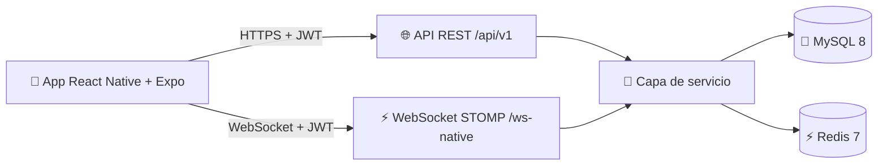

<!-- Hero -->
<div align="center">
  

  <h1>EraMix</h1>

  <p>
    <strong>Aplicación móvil multiplataforma para la integración social de estudiantes Erasmus.</strong><br/>
    Hacer amigos en la ciudad de destino, sin que sea una app de citas.
  </p>

  <p>
    
    
    
    
    
    
    
    
  </p>
</div>

---

## Tabla de contenidos

- [Qué es EraMix](#qué-es-eramix)
- [Por qué existe](#por-qué-existe)
- [Características](#características)
- [Arquitectura](#arquitectura)
- [Stack tecnológico](#stack-tecnológico)
- [Instalación rápida](#instalación-rápida)
- [Estructura del proyecto](#estructura-del-proyecto)
- [Documentación adicional](#documentación-adicional)
- [Autor y contexto académico](#autor-y-contexto-académico)

## Qué es EraMix

EraMix es una aplicación móvil pensada para que los estudiantes Erasmus hagan amigos en la ciudad de destino. La pestaña de descubrimiento, los grupos, los eventos y las comunidades giran exclusivamente alrededor de la amistad y los intereses compartidos. **No es una app de citas**: el diseño y el flujo evitan deliberadamente las dinámicas y el estigma asociados a Tinder, Bumble BFF o similares.

## Por qué existe

La movilidad internacional crece año a año en el espacio europeo, pero las herramientas digitales para socializar entre estudiantes recién llegados están pensadas para otra cosa. Los recién llegados se quedan atrapados entre dos extremos: el grupo del piso —que con suerte funciona— y las apps de citas, que generan malentendidos.

EraMix nace de esa frustración, vivida en primera persona por el autor durante su período Erasmus en Varsovia. El objetivo es ofrecer un canal específico, seguro y enfocado únicamente en la amistad para quienes pasan unos meses fuera. Es una herramienta que el propio autor querría tener en el bolsillo.

## Características

- 🔍 **Descubrimiento de estudiantes** por intereses, universidad y proximidad geográfica.
- 💬 **Mensajería 1-a-1 y de grupo en tiempo real** sobre WebSocket STOMP autenticado por JWT.
- 📷 **Multimedia en chat**: texto, imagen, audio (notas de voz) y ubicación.
- 📅 **Eventos** públicos con creación, inscripción y feed de stories.
- 🌐 **Comunidades** temáticas y por universidad con feed de publicaciones.
- 🌍 **Globo 3D interactivo** con la densidad de estudiantes Erasmus por país (Three.js).
- 💰 **Gestión financiera del semestre** con presupuestos, alertas y gráficas.
- 🗣️ **Intercambio lingüístico** entre estudiantes con búsqueda de partner.
- 🤖 **Asistente Erasmus** para dudas frecuentes sobre alojamiento, idiomas y trámites.
- 🎨 **Sistema de diseño propio** "European Glass" aplicado en 105 pantallas.

## Arquitectura



Toda la comunicación entre el cliente y la persistencia pasa por el backend, que actúa como única superficie autenticada. El token JWT viaja en la cabecera `Authorization` para REST y como query param en el handshake del WebSocket.

## Stack tecnológico

| Capa | Tecnología | Versión |
|---|---|---|
| Frontend móvil | React Native + Expo + TypeScript | 0.81 · SDK 54 |
| Backend | Spring Boot + Java | 3.5 · 21 |
| Persistencia | MySQL | 8 |
| Caché | Redis | 7 |
| Tiempo real | Spring WebSocket + STOMP | — |
| Migraciones | Flyway | 31 versiones |
| Contenedorización | Docker + Docker Compose | — |
| Orquestación | Kubernetes (manifests en `k8s/`) | — |
| CI / CD | GitHub Actions | — |

## Instalación rápida

### Opción A — Arranque automatizado con `start.sh` (recomendado)

El proyecto incluye un script de arranque que levanta el backend, la base de datos y la caché en sus contenedores, espera a los healthchecks y deja la API publicando en `http://localhost:8080`.

```bash
git clone https://github.com/SantiCode17/eramix.git
cd eramix
cp .env.example .env      # editar valores si hace falta
./start.sh
```

### Opción B — Control manual con Docker Compose

```bash
docker compose up -d --build
curl http://localhost:8080/api/health    # debe responder {"status":"UP"}
```

Para detener y limpiar volúmenes: `docker compose down -v`.

### Frontend móvil

```bash
cd mobile
npm install
npx expo start
```

Escanear el QR con la app Expo Go en un dispositivo Android o iOS, o pulsar `a` para emulador Android.

## Estructura del proyecto

```
eramix/
├── backend/                 API REST + WebSocket en Spring Boot
│   ├── src/main/java/com/eramix/
│   │   ├── config/          WebSocket, Security, Cache, CORS, Metrics
│   │   ├── controller/      32 controladores REST + ChatController STOMP
│   │   ├── service/         29 servicios de negocio
│   │   ├── repository/      70 repositorios Spring Data JPA
│   │   ├── entity/          74 entidades JPA (+ 28 enums)
│   │   ├── dto/             113 DTOs validados con Jakarta Validation
│   │   ├── security/        JWT (filtro, provider, handshake interceptor)
│   │   ├── websocket/       Gestor de sesiones concurrentes
│   │   └── exception/       Handler global con @RestControllerAdvice
│   ├── src/main/resources/
│   │   ├── application.properties
│   │   └── db/migration/    31 migraciones Flyway (V1-V32)
│   └── Dockerfile           Multi-stage Alpine, usuario no root
│
├── mobile/                  Cliente React Native con Expo
│   └── src/
│       ├── api/             Cliente Axios + servicios por dominio
│       ├── services/        WebSocket singleton, notificaciones
│       ├── store/           Slices Zustand
│       ├── design-system/   Tokens + componentes "European Glass"
│       ├── navigation/      17 navegadores (Stack + Tabs + Drawer)
│       ├── screens/         105 pantallas en 21 dominios
│       └── hooks/, utils/, types/, config/
│
├── docs/                    Documentación complementaria
│   ├── SOSTENIBILIDAD.md
│   ├── NUBE_PUBLICA.md
│   ├── DESIGN_SYSTEM.md
│   └── multimedia/logo.svg
│
├── k8s/                     Manifests Kubernetes (11 ficheros)
├── .github/workflows/       backend-ci, mobile-ci, deploy
├── docker-compose.yml       Orquestación local (db + redis + backend)
├── docker-compose.dev.yml   Solo base de datos para desarrollo nativo
├── start.sh                 Arranque automatizado
└── .env.example             Variables documentadas
```

## Documentación adicional

- 🌱 [**Sostenibilidad y ecodiseño**](docs/SOSTENIBILIDAD.md) — Decisiones técnicas para reducir la huella digital del proyecto. Documento de evidencia para el RA 5 (módulo Sostenibilidad).
- ☁️ [**Despliegue y nube pública**](docs/NUBE_PUBLICA.md) — Configuración cloud, redes y buenas prácticas de seguridad. Documento de evidencia para el RA 3 (módulo Introducción a la nube pública).
- 🎨 [**Sistema de diseño European Glass**](docs/DESIGN_SYSTEM.md) — Tokens, componentes atómicos y principios de diseño.

## Autor y contexto académico

EraMix es el Proyecto Intermodular de **Santiago Sánchez March** para el segundo curso del ciclo de **Desarrollo de Aplicaciones Multiplataforma (DAM)** en el **IES Salvador Gadea** (Aldaia, Valencia), curso 2025-2026. Tutor del proyecto: **Daniel Sebastián**.

El proyecto se desarrolla durante un período de movilidad Erasmus en Varsovia y resuelve un problema que el autor experimenta en primera persona.

## Licencia

Proyecto académico. Uso educativo y de evaluación.
