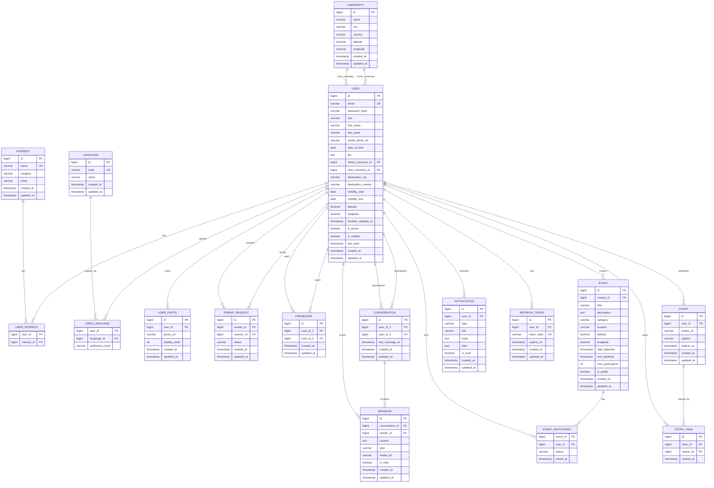

# EraMix — Diagrama Entidad-Relación

Modelo de datos completo de la plataforma EraMix.

## Diagrama ER (Mermaid)

## Notas de diseño

### Estrategias de indexación
- `user.email`: índice único para login O(1)
- `user.destination_city`, `user.destination_country`: índices para búsqueda por destino
- `user.home_university_id`, `user.host_university_id`: FK indexadas
- `friend_request(sender_id, receiver_id)`: índice compuesto único para evitar solicitudes duplicadas
- `friendship(user_id_1, user_id_2)`: índice compuesto único, siempre `user_id_1 < user_id_2`
- `message.conversation_id + created_at`: índice compuesto para paginación de mensajes
- `story.expires_at`: índice para limpieza de historias expiradas
- `notification(user_id, is_read)`: índice compuesto para notificaciones no leídas

### Convenciones
- Todas las tablas usan `BIGINT AUTO_INCREMENT` como PK
- Timestamps en UTC via `TIMESTAMP DEFAULT CURRENT_TIMESTAMP`
- Borrado lógico preferido sobre físico (campo `is_active`)
- Enums almacenados como `VARCHAR` para flexibilidad
- JSON usado solo en `notification.data` para contexto dinámico
